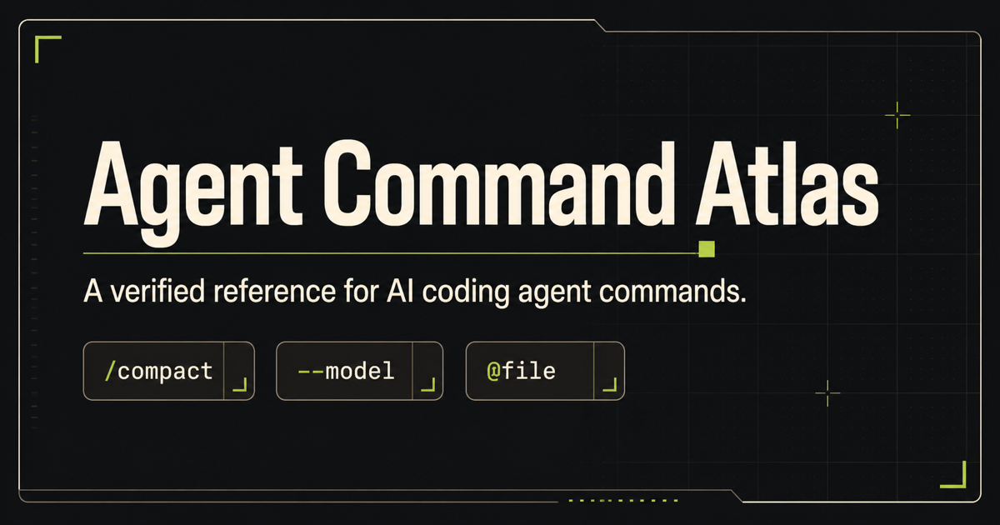

# Agent Command Atlas

**Stop guessing which AI coding-agent command to use.**

[](https://kishormorol.github.io/agent-command-atlas/)
[](https://github.com/kishormorol/agent-command-atlas/stargazers)
[](LICENSE)

Agent Command Atlas is a searchable, source-linked reference for the commands and control surfaces developers use every day with AI coding agents.

It covers five ecosystems in one consistent, honest interface:

1. OpenAI Codex
2. Anthropic Claude Code
3. Google Gemini CLI
4. Cursor
5. GitHub Copilot CLI

The project turns one canonical dataset into complementary outputs:

- an open GitHub command and capability database;
- a fast, searchable documentation website.

**[Open the live Atlas →](https://kishormorol.github.io/agent-command-atlas/)**

Search `compact`, `resume old session`, `MCP`, or `model` and get useful results across tools—not just exact command-name matches. Every result links to an official source and shows syntax, examples, maturity, availability, and verification state.



## Why developers use it

- **Find commands by intent.** Search what you want to do, even when vendors use different names.
- **Compare semantics honestly.** Relationships are labeled exact, similar, partial, none, or unknown.
- **Copy a real example.** Command pages include minimal and practical invocations with usage guidance.
- **Trust the source.** Records link to official vendor documentation or source repositories.
- **See what is changing.** Experimental, conditional, rolling-out, deprecated, and removed controls stay visible.

## What the atlas covers

- Slash and interactive commands
- CLI commands and flags
- Keyboard shortcuts and prefix commands such as `@` and `!`
- Configuration files and environment variables
- Permissions, sandboxing, and modes
- MCP, skills, hooks, agents, and subagents
- Sessions, models, Git, and worktrees

Accuracy takes priority over command count. Entries link to official documentation or official source repositories, record verification state and date, and preserve experimental, conditional, rolling-out, deprecated, or removed status.

## A quick tour

| You want to… | Start here |
| --- | --- |
| Find a context-compaction command | [Search compact context](https://kishormorol.github.io/agent-command-atlas/?q=compact%20context) |
| Resume an earlier session | [Search resume session](https://kishormorol.github.io/agent-command-atlas/?q=resume%20old%20session) |
| Compare MCP controls | [Open the capability atlas](https://kishormorol.github.io/agent-command-atlas/compare/) |
| Browse one ecosystem | [Open coverage](https://kishormorol.github.io/agent-command-atlas/coverage/) |

## Built for contributors

This is a living open-source reference. If a command is missing, renamed, conditional, or inaccurately described, contribute the structured record and its authoritative source. The website, indexes, and capability views are generated from that data so corrections propagate consistently.

## Data is the source of truth

```text
data/ ──▶ validated catalog ──▶ website
  │
  └──────────────────────────▶ cross-tool capability atlas
```

Do not manually maintain large command inventories in this README or the website. Edit the authored JSON under `data/`, then regenerate the derived files.

## Repository layout

```text
data/        canonical entries, taxonomies, tools, and source registry
schema/      JSON Schemas for entries and capabilities
scripts/     validation and deterministic generators
site/        static search interface and generated catalogs
tests/       repository integrity tests
docs/        architecture notes and roadmap
```

See [the data model](docs/DATA_MODEL.md) for field semantics and cross-tool relationship rules, and [the website architecture](docs/WEBSITE.md) for generated routes and search behavior.

## Local development

```bash
python -m pip install -r requirements.txt
python scripts/validate.py
python -m unittest discover -s tests
node --check site/app.js
node tests/test_site_search.js
python scripts/build_catalog.py
python -m http.server 8000 --directory site
```

Open `http://localhost:8000`. To check that registered official URLs still resolve, run `python scripts/check_sources.py`; this optional check requires internet access.

The `Publish Atlas website` workflow validates and regenerates `site/` before deploying it to GitHub Pages. See [the website architecture](docs/WEBSITE.md#publishing) for publishing requirements.

## Contributing entries

1. Choose the file for the relevant ecosystem under `data/<tool>/`.
2. Verify behavior against an official source.
3. Add or update the structured entry, including maturity, availability, source, and verification metadata.
4. Add capability mappings only after comparing semantics, not names.
5. Run validation, tests, and the catalog generator.
6. Include generated output changes in the same pull request.

Read [CONTRIBUTING.md](CONTRIBUTING.md) for detailed requirements.

## Project status

The atlas now covers interactive commands, nested subcommands, CLI flags, configuration, environment variables, shortcuts, hooks, permissions, MCP, skills, and agent controls across all five ecosystems. It remains a living reference rather than a claim that fast-changing vendor surfaces can ever be permanently complete. See [the roadmap](docs/ROADMAP.md).
