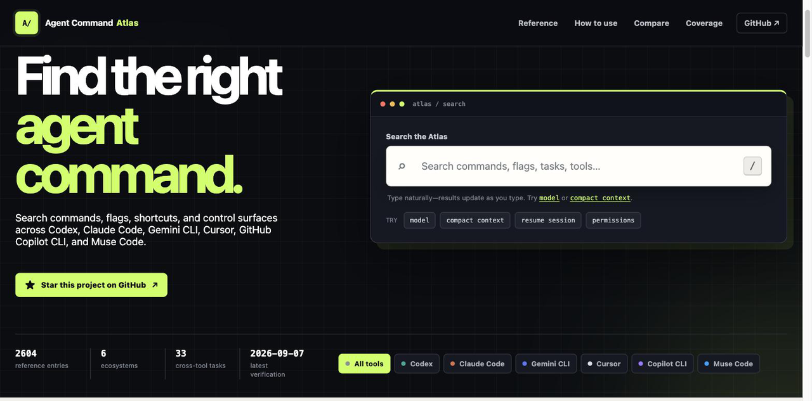

# Agent Command Atlas

**Stop guessing which AI coding-agent command to use.**

[](https://kishormorol.github.io/agent-command-atlas/)
[](https://github.com/kishormorol/agent-command-atlas/releases)
[](https://github.com/kishormorol/agent-command-atlas/stargazers)
[](LICENSE)

One searchable, source-linked reference for the commands, flags, shortcuts, and control surfaces of six AI coding agents: **OpenAI Codex, Anthropic Claude Code, Google Gemini CLI, Cursor, GitHub Copilot CLI, and Meta Muse Code.**

**[Open the live Atlas →](https://kishormorol.github.io/agent-command-atlas/)**



| Reference entries | Ecosystems | Cross-tool tasks | Capability mappings |
| --- | --- | --- | --- |
| 2,604 | 6 | 33 | 198, none left unknown |

## Search by intent, not by name

Every vendor names the same idea differently. Search what you want to *do* and get results across all six tools.

| You want to… | Try it |
| --- | --- |
| Compact the context window | [`compact context`](https://kishormorol.github.io/agent-command-atlas/?q=compact%20context) → `/compact`, `/compress`, `/summarize` |
| Resume an earlier session | [`resume old session`](https://kishormorol.github.io/agent-command-atlas/?q=resume%20old%20session) |
| Compare MCP controls side by side | [Capability atlas](https://kishormorol.github.io/agent-command-atlas/compare/) |
| See what each ecosystem covers | [Coverage dashboard](https://kishormorol.github.io/agent-command-atlas/coverage/) |

Every result links to an official source and shows syntax, examples, maturity, availability, and verification state.

## Why it is trustworthy

Accuracy takes priority over command count.

- **Every entry cites an official source.** All 2,604 records link to vendor documentation or an official source repository, and `scripts/check_sources.py` confirms every registered URL still resolves.
- **Verification state is recorded, not assumed.** Each entry carries how it was checked and when. 2,597 are officially documented. The other seven are recorded against a shipping binary instead: two Cursor flags the vendor reference no longer lists, and five Codex subcommands the command reference does not yet list.
- **Claims are checked against real binaries.** Entries were verified against Claude Code 2.1.263, Codex 0.151.0, Gemini CLI 0.58.0, GitHub Copilot CLI 1.0.83, and Cursor 2026.09.02-c22c1a3. Muse Code entries remain documentation-backed. Its 1.1.1 binary is inspectable: version and help output were checked, and the Linux x86 executable matched the checksum and size in [Meta's release manifest](https://lookaside.facebook.com/lookaside/muse/download/?channel=muse&version=1.1.1-R2514.1&file=manifest.json). This does not establish runtime verification of every Muse entry.
- **Cross-tool claims are semantic, not lexical.** Relationships are labeled `exact`, `similar`, `partial`, `none`, or `unknown`. All 198 mappings are currently resolved — `none` is an evidence-backed conclusion, never a gap in research.
- **Nothing is quietly deleted.** Experimental, conditional, rolling-out, deprecated, and removed controls stay visible, including controls the docs still list that the binary no longer has.

## What the atlas covers

- Slash and interactive commands
- CLI commands, nested subcommands, and flags
- Keyboard shortcuts and prefix commands such as `@` and `!`
- Configuration files and environment variables
- Permissions, sandboxing, and modes
- MCP, skills, hooks, agents, and subagents
- Sessions, models, Git, and worktrees

## Data is the source of truth

```text
data/ ──▶ validated catalog ──▶ website
  │
  └──────────────────────────▶ cross-tool capability atlas
```

The website, indexes, and capability views are all generated from the authored JSON under `data/`, so a correction propagates everywhere. Never hand-maintain command inventories in the README or the website — edit `data/`, then regenerate.

```text
data/        canonical entries, taxonomies, tools, and source registry
schema/      JSON Schemas for entries and capabilities
scripts/     validation and deterministic generators
site/        static search interface and generated catalogs
tests/       repository integrity tests
docs/        architecture notes and roadmap
```

See [the data model](docs/DATA_MODEL.md) for field semantics and relationship rules, and [the website architecture](docs/WEBSITE.md) for routes and search behavior.

## Contributing

This is a living reference. If a command is missing, renamed, conditional, or wrong, the fix is a structured record plus its authoritative source.

1. Choose the file for the relevant ecosystem under `data/<tool>/`.
2. Verify behavior against an official source.
3. Add or update the entry, including maturity, availability, source, and verification metadata.
4. Add capability mappings only after comparing semantics, not names.
5. Run validation, tests, and the catalog generator, and include the generated output in the same pull request.

Read [CONTRIBUTING.md](CONTRIBUTING.md) for the full requirements.

### Local development

```bash
python -m pip install -r requirements.txt
python scripts/validate.py
python -m unittest discover -s tests
node --check site/app.js
node tests/test_site_search.js
python scripts/build_catalog.py
python -m http.server 8000 --directory site
```

Open `http://localhost:8000`. To confirm every registered source URL still resolves, run `python scripts/check_sources.py` — an optional check that needs internet access.

The `Publish Atlas website` workflow revalidates and regenerates `site/` before deploying to GitHub Pages. See [publishing requirements](docs/WEBSITE.md#publishing).

## Project status

The atlas covers interactive commands, nested subcommands, CLI flags, configuration, environment variables, shortcuts, hooks, permissions, MCP, skills, and agent controls across all six ecosystems. It stays a living reference rather than a claim that fast-moving vendor surfaces can ever be permanently complete. See [the roadmap](docs/ROADMAP.md).

## Acknowledgements

Thanks to the people who have improved the atlas beyond its data:

- [@WhiteHades](https://github.com/WhiteHades) — case-sensitive CLI flag ranking, accessible skip links and mobile navigation, route collision checks, HTTPS redirect enforcement, and validation that reports malformed records instead of raising.

Released under the [MIT License](LICENSE).
